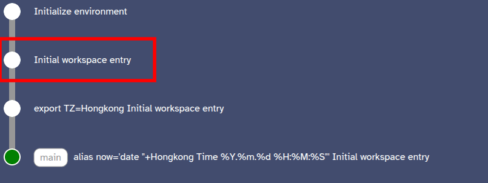
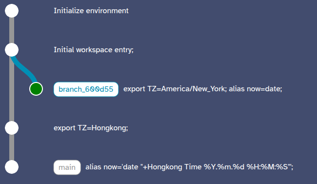

# Hello World Example
- Please compile Laplace following instructions at [top level README](../../README.md).
- Then, run `docker build -t laplace:hello .`

## Load Prepared Example
- Laplace allows for loading prior serialized data (see [prepared](./prepared/) folder).
- Please run `tar xzvf prepared.tar.gz` to extract the serialized data, including the Git metadata.
- Then, run `docker run --rm -it -p 8008:8008/tcp -v./prepared:/__laplace laplace:hello`. You can now jump to step 6 of the [next session](#constructing-from-scratch).
  > Feel free to use the `laplace:alpine` image instead.

## Constructing from Scratch
1. Launch the Ubuntu-Bash variant of Laplace directly using the following command
   ``` bash
   docker run --rm -it -p 8008:8008/tcp -v./playground:/__laplace laplace:bash
   ```
2. Open the frontend directly through the [html file](../../frontend.html)
3. In the shell, run `export TZ=Hongkong` and then `alias now='date "+Hongkong Time %Y.%m.%d %H:%M:%S"'`. These should show as two commits on the frontend.
4. In the frontend, switch to a prior commit by clicking the initial workspace entry commit as indicated, and selecting "jump to commit"
   
5. In the shell, run `export TZ=America/New_York;alias now=date`
6. In the frontend, jump between the "tips" of the two branches, and run the `now` command
  
  - In the initial branch, `now` should print something like: `Hongkong Time 2025.04.22 02:48:46`
  - In the second branch, `now` should print something like `Tue Apr 22 23:14:05 EDT 2025`
