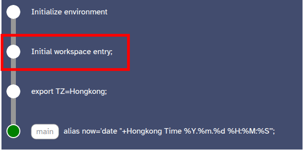

# Hello World Example
1. Compile Laplace following instructions at [top level README](../../README.md).
2. Launch the Ubuntu-Bash variant of Laplace directly using the following command
   ``` bash
   docker run --rm -it -p 8008:8008/tcp -v./playground:/__laplace laplace:bash
   ```
3. Open the frontend directly through the [html file](../../frontend.html)
4. In the shell, run `export TZ=Hongkong` and then `alias now='date "+Hongkong Time %Y.%m.%d %H:%M:%S"'`. These should show as two commits on the frontend.
5. In the frontend, switch to a prior commit by clicking the initial workspace entry commit as indicated, and selecting "jump to commit"
   
6. In the shell, run `export TZ=America/New_York;alias now=date`
7. In the frontend, jump between the "tips" of the two branches, and run the `now` command
  
  - In the initial branch, `now` should print something like: `Hongkong Time 2025.04.22 02:48:46`
  - In the second branch, `now` should print something like `Tue Apr 22 02:47:47 America 2025`