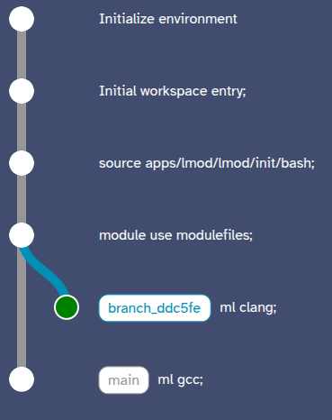

# Existing Work
- On PACE Phoenix, the Zlib LMOD file includes the following
  
    ``` lua
    prepend_path("LIBRARY_PATH","...")
    prepend_path("LD_LIBRARY_PATH","...")
    prepend_path("CPATH","...")
    prepend_path("MANPATH","...")
    prepend_path("PKG_CONFIG_PATH","...")
    prepend_path("CMAKE_PREFIX_PATH","...")
    setenv("ZLIBROOT","...")
    setenv("ZLIB_ROOT","...")
    append_path("MANPATH","")
    ```
- The aim of this example is to show two examples of either using Laplace as an alternative to LMOD or as a level higher than LMOD

# Walkthrough
- Run `docker build -t laplace:lmod .`, this will take a while due to the amount of packages required to set up Lmod.

## Prepared Environment
- Run `tar xzvf prepared.tar.gz`
- Run `docker run --rm -it -p 8008:8008/tcp -v./parepared:/__laplace -v ./modulefiles:/root/modulefiles laplace:lmod`
- You can jump to steps 5 and 7 to run the test commands.

## Full Replication
1. Run `docker run --rm -it -p 8008:8008/tcp -v./playground:/__laplace -v ./modulefiles:/root/modulefiles laplace:lmod`
2. Run `source apps/lmod/lmod/init/bash` and then `module use /root/modulefiles`
3. Run `ml avail` and check that both gcc and clang modules are available
4. Run `ml gcc`, this loads the GCC compiler as default.
5. To test the `gcc` compiler, run `$CC -o test test.c` and then `./test`, this should print the following message
   ```
   Compiled with GCC 13.3.0
   ```
6. Switching back to the `ml avail` commit in the frontend, do `ml clang`
7. Run the same test commands, now the following message should be printed
   ```
   Compiled with Clang 18.1.3
   ```

